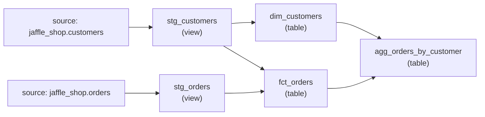

# dbt State Demo

This project is intentionally small so dbt state selection behavior is easy to
see in demos.

## Full lineage



## Models

- `stg_customers` (view): cleans the raw customer source.
- `stg_orders` (view): cleans the raw order source.
- `dim_customers` (table): customer dimension sourced only from customers.
- `fct_orders` (table): order fact table enriched with customer attributes.
- `agg_orders_by_customer` (table): final customer-level order summary. Click this
  model in lineage views to see the full demo DAG.

## Demo commands

### 1. Reset dev and prod schemas

```shell
dbt run-operation --target dev --sql "DROP SCHEMA IF EXISTS {{ target.database }}.{{ target.schema }} CASCADE"
dbt run-operation --target prod --sql "DROP SCHEMA IF EXISTS {{ target.database }}.{{ target.schema }} CASCADE"
```

### 2. Build prod from a clean warehouse state

Use `write-only` for the first run so dbt State records the run without trying
to reuse prior cached relations.

```shell
dbt run --target prod --run-cache-mode write-only
```

### 3. Re-run prod and show full reuse

```shell
dbt run --target prod
```

Expected result: all five models are `reused` because dbt State sees no new
upstream changes.

### 4. Touch only the orders source

```shell
dbt run-operation --target prod --sql "alter table analytics.jaffle_shop.orders set comment = 'demo $(date -u +%Y-%m-%dT%H:%M:%SZ)'"
```

Confirm that `ORDERS` was updated:

```shell
dbt show --target prod --inline "select table_catalog, table_schema, table_name, comment, last_altered from analytics.information_schema.tables where
  table_schema = 'JAFFLE_SHOP' and table_name = 'ORDERS'"
```

### 5. Re-run dev and show source impact with reuse

```shell
dbt run --target dev
```

Expected result: only the `orders` lineage runs:

```text
source:jaffle_shop.orders -> stg_orders -> fct_orders -> agg_orders_by_customer
```

The customer-only table `dim_customers` is `reused` because the `customers`
source lineage did not change.

### 6. Edit one downstream model and defer upstreams

Make a small SQL change to `models/marts/agg_orders_by_customer.sql`, then run
only that model:

```shell
dbt run --target dev --select agg_orders_by_customer
```

Expected result: only `agg_orders_by_customer` runs. Its upstream dependencies
are `deferred` to prod or `reused` from dbt State.

### 7. Build dev from prod state with clone

```shell
dbt run --target dev
```

Expected result: staging views are rebuilt, and table models are `cloned` or
`reused` from prod where dbt State can safely do so.
